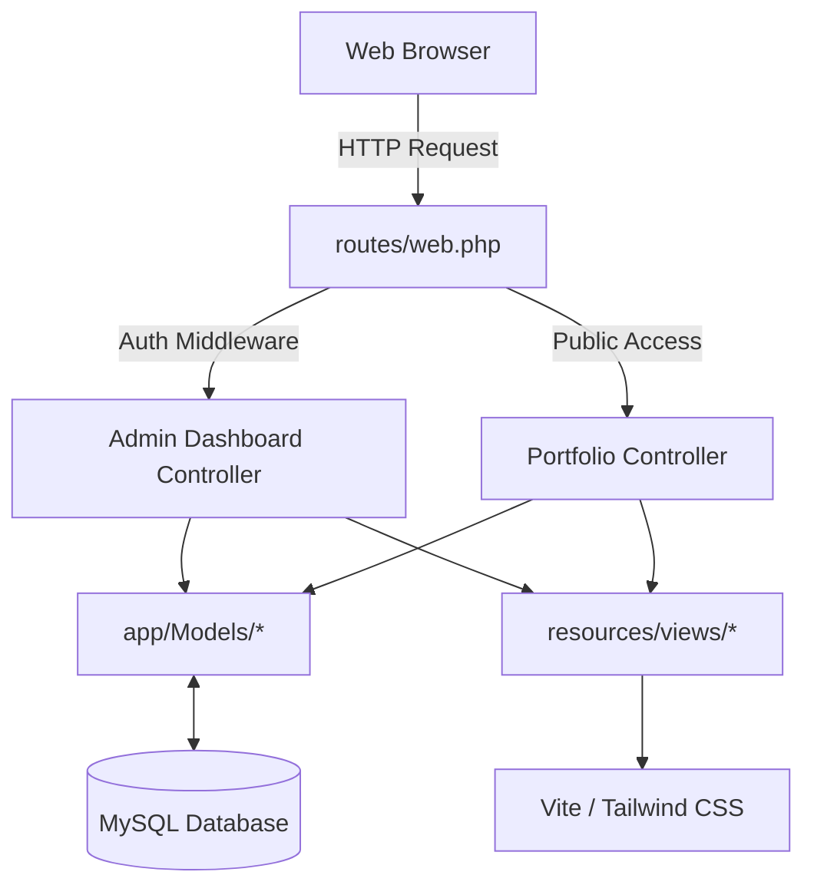

# Dimas Alva Rizki — Portofolio & Admin Dashboard (Apple Style Edition)

[](https://laravel.com)
[](https://tailwindcss.com)
[](https://vitejs.dev)
[](https://www.mysql.com)
[](https://apple.com)

Website portofolio full-stack profesional dan modern yang dirancang dengan **Apple Style Reference Design System** (Galeri Putih *Gallery White*, kontras seksi *Studio Mist*, kartu *shadowless* 28px, dan bilah navigasi kapsul mengambang). Dilengkapi dengan **Dashboard Admin (CMS)** mandiri, **Interactive Keynote Slider** galeri projek, serta asisten virtual **DimasBot AI (Apple Intelligence)** yang terintegrasi dengan OpenRouter API.

---

## 🎨 Apple Style Reference Design System

Antarmuka web portofolio ini dibangun dengan mematuhi pedoman desain presisi Apple:

*   **Panggung Galeri Putih (*Gallery White Canvas*)**: Latar utama `#ffffff` bersih dengan panggung hero tanpa batas (*edge-free*), kontras selang-seling dengan seksi `#f5f5f7` (*Studio Mist*).
*   **Navigasi Kapsul Mengambang (*Floating Capsule Local Navbar*)**: Bilah navigasi 52px melayang dengan radius 20px, efek kaca buram `backdrop-filter: blur(20px)`, batas halus `#d6d6d6`, tombol *Outlined Explore Pill*, dan tombol *Pricing Blue Pill* (`#0071e3`).
*   **Tipografi Presisi Apple**: Mengadopsi skala `SF Pro Display` & `SF Pro Text` (Headline Hero 80px/600 dengan *tracking* padat `-1.2px`, Judul Fitur 40px/600, Subjudul 21px, Teks Bodi 17px/400 dengan *-0.374px tracking*, dan label status rilis *Launch Orange* `#b64400`).
*   **Kartu Flat & Shadowless**: Kartu beradius **28px** tanpa bayangan tebal (*shadowless*), pemisahan visual tercipta murni dari kontras `#ffffff` di atas `#f5f5f7` dan garis pembatas *Hairline Silver* (`#d6d6d6` / `#e5e5e7`).
*   **Apple Keynote Slider**: Galeri screenshot projek interaktif dengan tombol geser bulat translusen `rgba(210,210,215,0.64)`, indikator titik mengambang, serta bilah *thumbnail* yang tersinkronisasi otomatis.

---

## 🚀 Teknologi Utama

### **Backend & Framework**
*   **PHP >= 8.2**
*   **Laravel 12** – Framework MVC PHP yang ekspresif, aman, dan modular.
*   **Eloquent ORM** – Pemetaan relasi database objek secara intuitif.
*   **Laravel Artisan CLI** – Utilitas *command line* untuk migrasi, seeder, server, dan optimasi.

### **Frontend & UI**
*   **Tailwind CSS v4** – Framework utility-first CSS generasi terbaru yang diintegrasikan langsung lewat plugin Vite (`@tailwindcss/vite`).
*   **Bootstrap 5 (Grid & Carousel Engine)** – Untuk fleksibilitas sistem grid dan transisi karosel yang mulus.
*   **Blade Templates** – Sistem templating bawaan Laravel untuk memisahkan UI dan logika.
*   **JavaScript (ES6+) & Marked.js** – Pengendali manipulasi DOM, AJAX, parsing pesan AI Markdown, filter projek, dan Lightbox zoom.

### **Database & Tools**
*   **MySQL** – Penyimpanan database relasional.
*   **Vite 7** – Frontend build tool berkecepatan tinggi untuk bundling aset CSS dan JS secara real-time.
*   **OpenRouter API** – Proxy kecerdasan buatan (Gemini 2.5 Flash) untuk asisten virtual DimasBot AI.
*   **Intervention/Image (v3)** – Library pemrosesan gambar untuk meresize otomatis (lebar maks 1920px), mengompresi, dan mengonversi ke format efisien `.webp`.

---

## 📁 Arsitektur Aplikasi (MVC)

Proyek ini menerapkan pola arsitektur **Model-View-Controller (MVC)** standar Laravel:



### 1. Model Data (`app/Models`)
*   `User.php`: Autentikasi dan informasi akun administrator.
*   `Project.php`: Detail projek portofolio (Judul, deskripsi, gambar utama, link demo, tech stack, dan array JSON `additional_images` untuk slider).
*   `Setting.php`: Konfigurasi metadata global (nama bio, IPK, tautan CV, nomor WhatsApp, tautan sosial media).
*   `Experience.php`: Riwayat pendidikan dan pengalaman kerja untuk komponen keynote timeline.
*   `Skill.php`: Data keahlian profesional yang dikelompokkan berdasarkan kategori arsitektur.
*   `Certification.php`: Riwayat sertifikat resmi lengkap dengan tautan verifikasi kredensial.
*   `Contact.php`: Penyimpanan pesan yang dikirimkan oleh pengunjung melalui formulir kontak.

### 2. Controller & Logika Bisnis (`app/Http/Controllers`)
*   `PortfolioController.php`:
    *   `index()`: Mengumpulkan data portofolio dari database dengan caching performa `Cache::remember` dan merender landing page Apple.
    *   `show()`: Menampilkan detail projek spesifik beserta Apple Keynote Slider dan galeri screenshot.
    *   `store()`: Menyimpan pesan pengunjung dari formulir kontak.
    *   `chatbot()`: Endpoint API proxy OpenRouter dengan injeksi konteks riwayat Dimas untuk keamanan dan personalisasi respon AI.
*   `AuthController.php`: Menangani otentikasi login dan logout panel administrator.
*   `Admin/ProjectController.php`: CRUD projek lengkap dengan multi-upload gambar dan penghapusan gambar individual via AJAX.

### 3. View & Tampilan (`resources/views`)
*   `welcome.blade.php`: Halaman utama portofolio bergaya Apple Showroom lengkap dengan floating capsule navbar, panggung hero, bento skills, timeline, showcase projek, formulir kontak, dan DimasBot AI.
*   `project-detail.blade.php`: Halaman dokumentasi projek dengan Apple Keynote Slider, kontrol translusen, sinkronisasi thumbnail, dan Lightbox modal.
*   `layouts/admin.blade.php`: Master template untuk dashboard panel admin.

---

## ⚡ Optimasi & Performa Caching

Untuk memastikan kecepatan akses website tetap maksimal di lingkungan hosting produksi:
1.  **Query Caching**: Seluruh pemanggilan data portofolio publik di `PortfolioController.php` dibungkus menggunakan `Cache::remember`.
2.  **Auto Invalidation Trait**: Menggunakan Trait `app/Traits/ClearsPortfolioCache.php` pada model `Project`, `Setting`, `Experience`, `Skill`, dan `Certification`. Setiap kali admin menambah/mengubah/menghapus data melalui dashboard admin, cache `portfolio_data` akan otomatis dibersihkan sehingga perubahan langsung tampil secara real-time.

---

## 🛠️ Cara Menjalankan Server Development

### Persyaratan Sistem
Sebelum memulai, pastikan perangkat Anda telah terpasang:
*   PHP >= 8.2 (dengan ekstensi `pdo_mysql`, `gd`, `fileinfo` aktif)
*   Composer (Dependency Manager PHP)
*   Node.js (versi LTS direkomendasikan) & NPM
*   MySQL Server (misalnya melalui XAMPP)

---

### Langkah-Langkah Instalasi

1.  **Clone Project**:
    ```bash
    git clone https://github.com/dimasalvarizk/portofolio.git
    cd portofolio
    ```

2.  **Instalasi Package Backend**:
    ```bash
    composer install
    ```

3.  **Salin Konfigurasi Environment**:
    ```bash
    copy .env.example .env
    ```

4.  **Generate Application Key**:
    ```bash
    php artisan key:generate
    ```

5.  **Konfigurasi Database & API Key**:
    Buka file `.env` dan sesuaikan koneksi database MySQL:
    ```env
    DB_CONNECTION=mysql
    DB_HOST=127.0.0.1
    DB_PORT=3306
    DB_DATABASE=portofolio
    DB_USERNAME=root
    DB_PASSWORD=
    ```
    Tambahkan OpenRouter API Key jika ingin mengaktifkan DimasBot AI:
    ```env
    OPENROUTER_API_KEY=sk-or-v1-xxxxxxxxxxxxxxxxxxxx
    ```

6.  **Migrasi & Seed Data Awal**:
    ```bash
    php artisan migrate --seed
    ```
    > **Catatan Akun Admin Default**:
    > *   **Email**: `dimas@gmail.com`
    > *   **Password**: `password`

7.  **Instalasi & Build Aset Frontend**:
    ```bash
    npm install
    npm run build
    ```

8.  **Hubungkan Penyimpanan Storage**:
    ```bash
    php artisan storage:link
    ```

9.  **Jalankan Server Development**:
    ```bash
    php artisan serve
    ```
    Buka browser Anda di `http://127.0.0.1:8000`.

---

## ☁️ Catatan Tambahan untuk Hosting & Deployment

1.  **Storage Link Symlink**:
    Akses `http://domain-anda.com/admin/storage-link` jika hosting membatasi akses terminal.
2.  **Fallback Route Storage**:
    Sistem dilengkapi *Fallback Route* di `routes/web.php` untuk melayani pemanggilan berkas gambar secara aman langsung dari controller jika hosting melarang symbolic link.
3.  **Browser Optimizer Route (Solusi Tanpa Terminal/SSH)**:
    Masuk ke dashboard Admin dan akses:
    `http://domain-anda.com/admin/optimize-hosting`
    
    Rute ini otomatis membersihkan semua cache lama, mencache config, rute, mengompilasi view, dan menghubungkan storage link secara instan.

---

## 📄 Lisensi

Proyek ini dibuat untuk tujuan portofolio profesional dan pengembangan sistem web oleh **Dimas Alva Rizki**. Dilindungi di bawah hak cipta &copy; 2026.
