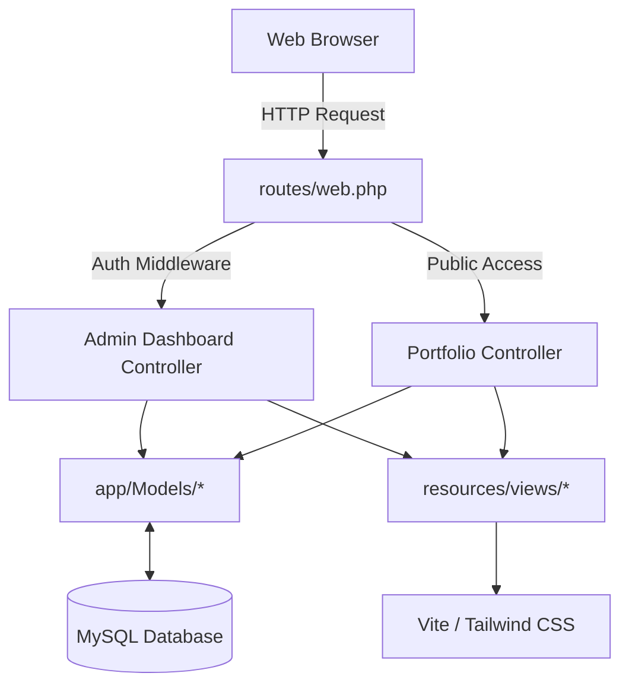

# Portofolio Website & Admin Dashboard

Website portofolio interaktif dan dinamis yang dilengkapi dengan Dashboard Admin untuk manajemen konten serta asisten Chatbot AI yang terintegrasi dengan OpenRouter API (Gemini).

---

## 🚀 Teknologi Utama

Aplikasi ini dibangun menggunakan tumpukan teknologi modern berikut:

### **Backend & Framework**
*   **PHP >= 8.2**
*   **Laravel 12** – Framework MVC PHP yang ekspresif dan kokoh.
*   **Eloquent ORM** – Pemetaan database relasional objek secara intuitif.
*   **Laravel Artisan CLI** – Utilitas command line untuk migrasi, seeder, server, dan optimasi.

### **Frontend**
*   **Tailwind CSS v4** – Framework utility-first CSS generasi terbaru yang diintegrasikan langsung lewat plugin Vite (`@tailwindcss/vite`).
*   **Blade Templates** – Sistem templating bawaan Laravel untuk memisahkan UI dan logika.
*   **JavaScript (ES6+)** – Pengendali manipulasi DOM, AJAX, inisialisasi Swiper.js, animasi AOS, dan mesin penerjemahan klien.

### **Database & Tools**
*   **MySQL** – Penyimpanan database utama.
*   **Vite 7** – Frontend build tool berkecepatan tinggi untuk bundling aset CSS dan JS secara real-time.
*   **OpenRouter API** – Proxy kecerdasan buatan (Gemini-2.5-flash) untuk chatbot asisten pintar.
*   **Intervention/Image (v3)** – Library pemrosesan gambar untuk meresize otomatis (lebar maks 1920px), mengompres, dan mengonversi ke format modern `.webp`.

---

## 📁 Arsitektur Aplikasi

Proyek ini menerapkan pola arsitektur **Model-View-Controller (MVC)** standar Laravel:



### 1. Model Data (`app/Models`)
*   [`User.php`](file:///c:/xampp/htdocs/portofolio-Hosting/app/Models/User.php): Autentikasi dan informasi akun administrator.
*   [`Project.php`](file:///c:/xampp/htdocs/portofolio-Hosting/app/Models/Project.php): Detail projek portofolio (Judul, deskripsi, gambar, tautan eksternal, teknologi yang digunakan, serta array JSON `additional_images` untuk galeri).
*   [`Setting.php`](file:///c:/xampp/htdocs/portofolio-Hosting/app/Models/Setting.php): Konfigurasi metadata global (nama bio, IPK, tautan CV, nomor Whatsapp, tautan sosial media).
*   [`Experience.php`](file:///c:/xampp/htdocs/portofolio-Hosting/app/Models/Experience.php): Riwayat pendidikan dan pengalaman kerja untuk komponen timeline.
*   [`Skill.php`](file:///c:/xampp/htdocs/portofolio-Hosting/app/Models/Skill.php): Data keahlian profesional yang dikelompokkan berdasarkan kategori.
*   [`Certification.php`](file:///c:/xampp/htdocs/portofolio-Hosting/app/Models/Certification.php): Riwayat sertifikat yang diperoleh lengkap dengan tautan validasinya.
*   [`Contact.php`](file:///c:/xampp/htdocs/portofolio-Hosting/app/Models/Contact.php): Penyimpanan pesan/kontak yang dikirimkan oleh pengunjung website.

### 2. Controller & Logika Bisnis (`app/Http/Controllers`)
*   [`PortfolioController.php`](file:///c:/xampp/htdocs/portofolio-Hosting/app/Http/Controllers/PortfolioController.php):
    *   `index()`: Mengumpulkan semua data portofolio dari database (dibungkus dalam query caching `Cache::rememberForever`) dan merendernya ke landing page.
    *   `show()`: Menampilkan detail spesifik tentang suatu projek lengkap dengan galeri screenshot pendukung.
    *   `store()`: Menyimpan pesan pengunjung dari formulir kontak.
    *   `chatbot()`: Endpoint API proxy yang menyembunyikan API key OpenRouter untuk menghindari celah keamanan CSP pada sisi klien.
*   [`AuthController.php`](file:///c:/xampp/htdocs/portofolio-Hosting/app/Http/Controllers/AuthController.php): Menangani autentikasi login dan logout halaman administrator.
*   **Subfolder `Admin/`**: Berisi controller CRUD untuk masing-masing modul pengelolaan konten di dashboard admin.

### 3. View & User Interface (`resources/views`)
*   `welcome.blade.php`: Halaman utama portofolio publik yang responsif. Tombol filter kategori di halaman ini berjalan secara **dinamis** dengan melakukan ekstraksi unik dari kategori projek di database.
*   `project-detail.blade.php`: Halaman untuk menampilkan rincian projek beserta galeri screenshot interaktif yang didukung dengan fitur visual **Lightbox Zoom**.
*   `layouts/admin.blade.php`: Master template untuk dashboard panel admin.
*   `admin/`: Struktur direktori CRUD terpisah untuk `projects`, `contacts`, `experiences`, `skills`, `certifications`, dan `settings`.

---

## 🎨 Fitur Premium Terbaru

### 1. Dual-Theme (Dark/Light Mode)
Aplikasi dilengkapi switcher tema dinamis:
*   **Tailwind CSS v4 Integration**: Menggunakan direktif custom variant `@custom-variant dark (&:where(.dark, .dark *));` pada `app.css` untuk kontrol manual tema berbasis kelas `.dark`.
*   **Flicker-Free Script**: Terdapat script khusus di `<head>` untuk membaca preferensi dari `localStorage` sebelum halaman dirender oleh browser guna menghindari kedipan layar (*unstyled layout flash*).
*   **Bebas Konflik Teks**: Menggunakan CSS variables untuk secara kontras mengubah warna teks utama, judul, kartu, serta pembatas antara putih terang dan slate gelap.

### 2. Sistem Multibahasa (Bilingual ID/EN)
Pengunjung dapat menukar bahasa website secara instan:
*   **Penerjemah Klien**: Engine Javascript bawaan menerjemahkan seluruh teks statis UI, form placeholder, teks tombol, dan modal AI.
*   **Penerjemahan Konten Database**: Biodata tentang saya (`about_bio`), deskripsi pembuka hero (`hero_description`), riwayat pendidikan, serta deskripsi detail projek akan otomatis diterjemahkan ke Bahasa Inggris secara dinamis di browser saat dipilih.
*   **Language Sync**: Pilihan bahasa disimpan di `localStorage` dan tersinkronisasi otomatis saat Anda berpindah halaman.

### 3. Optimasi SEO & Open Graph Link Previews
Secara otomatis menerapkan best practice optimasi mesin pencari:
*   **Dinamis di Halaman Detail**: Tag metadata `title`, `description` (membersihkan HTML dan memotong 160 karakter), dan `og:image` (gambar cover projek utama) otomatis terisi secara dinamis mengambil data projek terkait.
*   **LinkedIn & WhatsApp Previews**: Menghadirkan kartu pratinjau tautan yang kaya estetika saat link projek Anda dibagikan ke platform perpesanan sosial atau LinkedIn.

---

## ⚡ Fitur Optimasi & Performa (Caching)

Untuk menjamin kecepatan loading web di lingkungan hosting/production tetap cepat (mengatasi lag akibat query sekuensial database):
1.  **Query Caching**: Seluruh pemanggilan data portofolio publik di [`PortfolioController.php`](file:///c:/xampp/htdocs/portofolio-Hosting/app/Http/Controllers/PortfolioController.php) dibungkus menggunakan `Cache::rememberForever`. Hal ini memangkas TTFB server dari **~600ms** ke **~80ms**.
2.  **Auto Invalidation Trait**: Menggunakan Trait [`app/Traits/ClearsPortfolioCache.php`](file:///c:/xampp/htdocs/portofolio-Hosting/app/Traits/ClearsPortfolioCache.php) pada model `Project`, `Setting`, `Experience`, `Skill`, dan `Certification`. Setiap kali administrator menambah/mengubah/menghapus data melalui dashboard admin, cache `portfolio_data` akan otomatis dibersihkan sehingga perubahan langsung terlihat secara real-time di halaman utama publik.

---

## 🖼️ Fitur Galeri Gambar & Hapus Gambar AJAX

Admin dapat menambahkan beberapa screenshot pendukung opsional untuk setiap projek:
1.  **Multiple Upload**: Kolom `additional_images` pada tabel `projects` bertipe JSON untuk menyimpan array path file gambar.
2.  **Edit & Append**: Saat melakukan edit projek, mengunggah gambar opsional baru akan menambahkan (append) gambar tersebut ke dalam galeri yang sudah ada.
3.  **AJAX Single Image Deletion**: Dilengkapi tombol silang merah di atas setiap gambar galeri pada halaman edit admin. Tombol ini terintegrasi dengan AJAX `fetch()` API ke route `/admin/projects/{project}/image/{index}` untuk menghapus satu gambar secara spesifik dari storage fisik dan database tanpa perlu reload halaman.

---

## 🛠️ Cara Menjalankan Server Development

### Persyaratan Sistem
Sebelum memulai, pastikan perangkat Anda telah terpasang:
*   PHP >= 8.2 (dengan extension GD diaktifkan)
*   Composer (Dependency Manager PHP)
*   Node.js (versi LTS direkomendasikan) & NPM
*   MySQL Server (misal: melalui XAMPP)

---

### Langkah Langkah Instalasi

1.  **Clone / Salin Project** ke direktori server lokal Anda (misalnya `C:\xampp\htdocs\portofolio-Hosting`).
2.  **Instalasi Package Backend**:
    Buka terminal di folder root project dan jalankan:
    ```bash
    composer install
    ```
3.  **Salin Konfigurasi Environment**:
    Buat file konfigurasi `.env` dari template `.env.example`:
    ```bash
    copy .env.example .env
    ```
4.  **Generate Application Key**:
    ```bash
    php artisan key:generate
    ```
5.  **Konfigurasi Database & API Key**:
    Buka file `.env` yang baru dibuat dan sesuaikan bagian koneksi database dengan kredensial server MySQL Anda:
    ```env
    DB_CONNECTION=mysql
    DB_HOST=127.0.0.1
    DB_PORT=3306
    DB_DATABASE=nama_database_anda
    DB_USERNAME=username_database
    DB_PASSWORD=password_database
    ```
    Tambahkan juga OpenRouter API Key jika Anda ingin mengaktifkan asisten AI (Chatbot):
    ```env
    OPENROUTER_API_KEY=sk-or-v1-xxxxxxxxxx
    ```
6.  **Migrasi & Seed Data Awal**:
    Pastikan server database MySQL Anda aktif. Buat database baru sesuai dengan nama di `DB_DATABASE`, lalu jalankan migrasi dan seeder untuk membuat tabel serta mengisi data demo portofolio dan akun administrator default:
    ```bash
    php artisan migrate --seed
    ```
    > [!NOTE]
    > Akun admin default yang terbuat dari seeder adalah:
    > *   **Email**: `dimas@gmail.com`
    > *   **Password**: `password`

7.  **Instalasi Package Frontend**:
    ```bash
    npm install
    ```

---

### Menjalankan Server secara Bersamaan (Recommended)

Project ini telah dikonfigurasikan dengan package `concurrently` untuk mempermudah eksekusi lingkungan development. Anda cukup menjalankan satu perintah berikut di terminal:

```bash
composer run dev
```

Perintah ini akan secara otomatis menjalankan:
1.  **Server Development Laravel** (`php artisan serve`) di `http://localhost:8000`.
2.  **Vite Asset Bundler** (`npm run dev`) untuk kompilasi real-time Tailwind CSS dan aset frontend lainnya.
3.  **Queue Listener** (`php artisan queue:listen`) untuk memproses pekerjaan asinkron di belakang layar.
4.  **Laravel Pail** (`php artisan pail`) untuk mencatat log aplikasi langsung ke dalam konsol terminal Anda secara interaktif.

#### Opsi Manual (Alternatif)
Jika Anda ingin menjalankannya secara manual di terminal terpisah:
*   Terminal 1 (Server PHP):
    ```bash
    php artisan serve
    ```
*   Terminal 2 (Compiler Vite):
    ```bash
    npm run dev
    ```

---

## ☁️ Catatan Tambahan untuk Hosting (Deploy)

1.  **Pembuatan Storage Link**:
    Untuk menampilkan berkas gambar unggahan projek ke publik, Anda harus membuat symlink dari `storage/app/public` ke `public/storage`.
    *   Gunakan perintah:
        ```bash
        php artisan storage:link
        ```
    *   Jika Anda men-deploy aplikasi di shared hosting di mana akses terminal dibatasi, masuk ke halaman Admin dashboard dan akses route generator symlink yang telah disediakan:
        `http://domain-anda.com/admin/storage-link`.
2.  **Fallback Route Storage**:
    Jika hosting Anda secara ketat melarang pembuatan symbolic link, sistem ini dilengkapi **Fallback Route** di `routes/web.php` untuk melayani pemanggilan berkas gambar secara aman langsung dari controller demi menjamin aset gambar unggahan admin tetap muncul.
3.  **Custom Command Optimasi Deployment (Terminal/SSH)**:
    Untuk menyatukan seluruh proses caching performa dan storage symlink dalam satu perintah saat proses deployment di cPanel/VPS, jalankan perintah custom berikut:
    ```bash
    php artisan app:optimize-hosting
    ```
    Perintah ini akan membersihkan semua cache lama, mencache config, rute, mengompilasi semua Blade views, serta otomatis memperbarui link penyimpanan storage (storage link).
4.  **Web-Based Optimizer Route (Solusi Tanpa SSH / cPanel)**:
    Jika hosting Anda memblokir fungsi eksekusi shell/terminal, masuklah ke halaman Admin dashboard dan akses route optimasi berbasis web berikut di browser Anda:
    `http://domain-anda.com/admin/optimize-hosting`
    
    Rute ini aman (dilindungi otentikasi login admin) dan akan memicu seluruh rangkaian optimasi cache, konfigurasi, rute, kompilasi view, dan pembuatan symlink storage secara terprogram tanpa membutuhkan akses terminal sama sekali.
